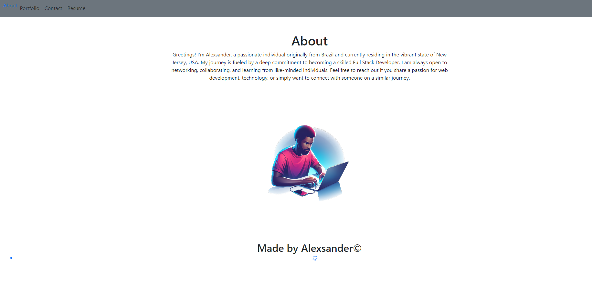

# React Challenge: React Portfolio

## Description
This is my portfolio created with React.js. It contains an About page, Portfolio page, Contact page, and Resume page. The Portfolio page contains a list of six of my favorite applications. The Resume page contains a link to my resume and a list of my proficiencies. In the footer there is a link to my Github.

## 🔗 Links
GITHUB REPO: https://github.com/alesk1v9/React-Portfolio.git

DEPLOYED APP: 

## Screenshots

